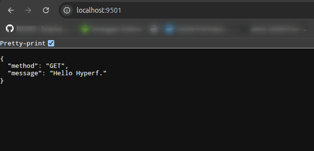

# Hyperf Skeleton



> This skeleton project is the result from [this article](https://rlucena.com/post/hyperf-php-coroutine-framework-baseado-em-swoole).

Setup project
```shell
cp .env.example .env
docker compose run --rm --entrypoint sh hyperf-skeleton
composer install
```

Run project
```shell
docker compose up -d
docker container exec -it hyperf-skeleton php bin/hyperf.php migrate
OR
php bin/hyperf.php migrate
```
